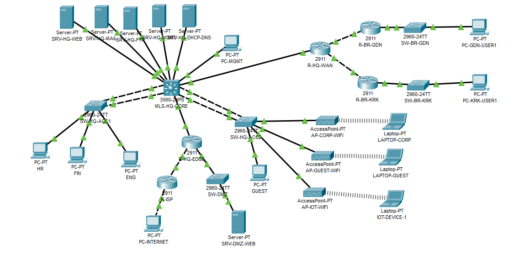

# Secure Multi-Site Enterprise Network



## Overview

This project is a secure multi-site enterprise network simulation built in **Cisco Packet Tracer**.

The goal of the project is to demonstrate practical network design skills, including campus LAN design, VLAN segmentation, inter-VLAN routing, dynamic routing, centralized services, AAA authentication, access control, DMZ design, NAT, wireless networking, IoT isolation, EtherChannel redundancy, STP tuning, and an IPv6 dual-stack pilot.

The network represents a company with a headquarters, two branch offices, internal services, public-facing DMZ services, wireless users, guest access, IoT devices, and a simulated Internet connection.

---

## Business Scenario

The simulated company has the following locations and network areas:

- Headquarters: Warsaw
- Branch Office 1: Krakow
- Branch Office 2: Gdansk
- Simulated ISP / Internet
- DMZ for public-facing services
- Wireless and IoT environment inside the headquarters

The company requires:

- Segmented internal network
- Secure access between departments
- Centralized network services
- Branch-to-HQ connectivity
- Dynamic routing
- Controlled access to management networks
- Guest and IoT isolation
- Public web service hosted in a DMZ
- Internet access through NAT/PAT
- Centralized AAA authentication
- Basic monitoring and time synchronization
- IPv6 pilot deployment

---

## Technologies Used

### Switching

- VLANs
- 802.1Q trunking
- Inter-VLAN routing
- EtherChannel
- Spanning Tree Protocol
- PortFast
- Port Security
- Disabled unused ports
- Native VLAN hardening

### Routing

- Layer 3 switching
- OSPF
- Static routes
- Default route advertisement
- Branch routing
- IPv6 dual-stack pilot

### Security

- Standard ACLs
- Extended ACLs
- Management access restrictions
- Guest VLAN isolation
- IoT VLAN isolation
- Branch-to-management restrictions
- AAA/RADIUS authentication
- Local fallback authentication
- MOTD banner
- Password encryption
- VTY access restrictions

### Services

- DHCP
- DNS
- HTTP / HTTPS
- Email
- FTP
- Syslog
- NTP
- AAA/RADIUS

### WAN / Edge / Internet

- Simulated ISP
- NAT/PAT
- Static NAT for DMZ server
- Public DMZ web service
- Outside-to-inside traffic filtering

### Wireless and IoT

- Corporate Wi-Fi
- Guest Wi-Fi
- IoT Wi-Fi
- Separate VLANs for wireless networks
- IoT network isolation

### IPv6

- IPv6 SDM template enabled on the multilayer switch
- IPv6 unicast routing
- IPv6 addresses on selected VLAN SVIs
- IPv6 connectivity between users and internal server VLAN

---

## Device List

| Device          | Role                                         |
| --------------- | -------------------------------------------- |
| MLS-HQ-CORE     | Headquarters multilayer core switch          |
| SW-HQ-ACC1      | HQ access switch for wired users             |
| SW-HQ-ACC2      | HQ access switch for guest, Wi-Fi and IoT    |
| R-HQ-WAN        | WAN router connecting HQ to branches         |
| R-BR-KRK        | Krakow branch router                         |
| R-BR-GDN        | Gdansk branch router                         |
| SW-BR-KRK       | Krakow branch access switch                  |
| SW-BR-GDN       | Gdansk branch access switch                  |
| R-HQ-EDGE       | Edge router for DMZ, NAT and Internet access |
| R-ISP           | Simulated ISP router                         |
| SW-DMZ          | DMZ switch                                   |
| SRV-HQ-DHCP-DNS | DHCP and DNS server                          |
| SRV-HQ-WEB      | Internal web server                          |
| SRV-HQ-MAIL     | Internal mail server                         |
| SRV-HQ-FTP      | Internal FTP server                          |
| SRV-HQ-MGMT     | Syslog, NTP and AAA server                   |
| SRV-DMZ-WEB     | Public DMZ web server                        |
| AP-CORP-WIFI    | Corporate wireless access point              |
| AP-GUEST-WIFI   | Guest wireless access point                  |
| AP-IOT-WIFI     | IoT wireless access point                    |

---

## VLAN Plan

| VLAN | Name             | IPv4 Subnet    | Purpose                      |
| ---: | ---------------- | -------------- | ---------------------------- |
|   10 | Management       | 10.10.10.0/24  | Network device management    |
|   20 | HR               | 10.10.20.0/24  | HR users                     |
|   30 | Finance          | 10.10.30.0/24  | Finance users                |
|   40 | Engineering      | 10.10.40.0/24  | Engineering users            |
|   50 | Corp-WiFi        | 10.10.50.0/24  | Corporate wireless users     |
|   70 | Guest            | 10.10.70.0/24  | Guest network                |
|   80 | IoT              | 10.10.80.0/24  | IoT devices                  |
|   90 | Servers          | 10.10.90.0/24  | Internal servers             |
|  100 | DMZ              | 10.10.100.0/24 | Public-facing DMZ services   |
|  999 | Native-Blackhole | No IP          | Unused/native VLAN hardening |

---

## IP Addressing Summary

### Headquarters VLAN Gateways

| VLAN | Gateway     |
| ---: | ----------- |
|   10 | 10.10.10.1  |
|   20 | 10.10.20.1  |
|   30 | 10.10.30.1  |
|   40 | 10.10.40.1  |
|   50 | 10.10.50.1  |
|   70 | 10.10.70.1  |
|   80 | 10.10.80.1  |
|   90 | 10.10.90.1  |
|  100 | 10.10.100.1 |

### Branch Networks

| Location      | Subnet        | Gateway    |
| ------------- | ------------- | ---------- |
| Krakow Branch | 10.20.10.0/24 | 10.20.10.1 |
| Gdansk Branch | 10.30.10.0/24 | 10.30.10.1 |

### WAN Links

| Link                     | Subnet          |
| ------------------------ | --------------- |
| MLS-HQ-CORE to R-HQ-WAN  | 10.255.0.0/30   |
| R-HQ-WAN to R-BR-KRK     | 10.255.1.0/30   |
| R-HQ-WAN to R-BR-GDN     | 10.255.2.0/30   |
| MLS-HQ-CORE to R-HQ-EDGE | 10.255.3.0/30   |
| R-HQ-EDGE to R-ISP       | 203.0.113.0/30  |
| ISP user network         | 198.51.100.0/24 |

---

## Internal Services

| Service        | Server          |   IP Address |
| -------------- | --------------- | -----------: |
| DHCP           | SRV-HQ-DHCP-DNS |  10.10.90.10 |
| DNS            | SRV-HQ-DHCP-DNS |  10.10.90.10 |
| Internal Web   | SRV-HQ-WEB      |  10.10.90.20 |
| Email          | SRV-HQ-MAIL     |  10.10.90.30 |
| FTP            | SRV-HQ-FTP      |  10.10.90.40 |
| Syslog         | SRV-HQ-MGMT     |  10.10.90.50 |
| NTP            | SRV-HQ-MGMT     |  10.10.90.50 |
| AAA/RADIUS     | SRV-HQ-MGMT     |  10.10.90.50 |
| Public DMZ Web | SRV-DMZ-WEB     | 10.10.100.20 |

---

## DNS Records

| DNS Name               |  IP Address |
| ---------------------- | ----------: |
| intranet.company.local | 10.10.90.20 |
| www.company.local      | 10.10.90.20 |
| mail.company.com       | 10.10.90.30 |
| ftp.company.local      | 10.10.90.40 |
| syslog.company.local   | 10.10.90.50 |
| ntp.company.local      | 10.10.90.50 |
| aaa.company.local      | 10.10.90.50 |

---

## Routing Design

OSPF is used as the main internal routing protocol.

The OSPF domain includes:

- Headquarters core switch
- HQ WAN router
- Krakow branch router
- Gdansk branch router
- HQ edge router

The edge router advertises a default route into OSPF, allowing internal networks and branch offices to reach the simulated Internet through NAT.

---

## Security Design

The project uses multiple security controls.

### Management Access Control

Only the Management VLAN is allowed to access network devices through VTY lines.

Allowed management subnet:

```text
10.10.10.0/24
```

This is enforced with `access-class` on VTY lines.

### AAA/RADIUS

Centralized authentication is configured using the AAA server.

- Central user: `netadmin`
- Local fallback user: `localadmin`
- RADIUS server: `10.10.90.50`

Console access uses local authentication as an emergency fallback.

Remote VTY access uses RADIUS authentication.

### Guest Isolation

The Guest VLAN is blocked from accessing internal private networks.

Guest users are allowed to use DNS and simulated Internet access, but they cannot access internal LAN VLANs or server networks.

### IoT Isolation

The IoT VLAN is isolated from the internal LAN.

IoT devices are allowed to use DNS and simulated Internet access, but they cannot freely access user VLANs or management networks.

### Branch Restrictions

Branch users can access internal services such as web, DNS, email and FTP, but they are blocked from accessing the Management VLAN.

### Port Security

Port security is enabled on selected access ports.

Configuration includes:

- Sticky MAC learning
- Maximum MAC limit
- Restrict violation mode

### Unused Ports

Unused switch ports are:

- Moved to VLAN 999
- Administratively shut down

---

## DMZ and NAT Design

The network includes a DMZ connected to the HQ edge router.

The public DMZ web server is reachable from the simulated Internet using static NAT.

| Public IP    | Internal DMZ IP | Service |
| ------------ | --------------- | ------- |
| 203.0.113.20 | 10.10.100.20    | HTTP    |

Internal users and branch users access the simulated Internet through PAT using the outside interface of `R-HQ-EDGE`.

The outside ACL allows HTTP access to the public DMZ server and blocks direct access to internal private networks.

---

## Wireless and IoT Design

Three separate wireless networks are used:

| SSID       | VLAN | Purpose                   |
| ---------- | ---: | ------------------------- |
| CORP-WIFI  |   50 | Corporate wireless access |
| GUEST-WIFI |   70 | Guest access              |
| IOT-WIFI   |   80 | IoT devices               |

Each SSID is mapped to a different access VLAN using separate access points.

Corporate Wi-Fi users can access internal services.

Guest and IoT users are restricted by ACLs.

---

## IPv6 Pilot

An IPv6 dual-stack pilot was implemented on selected VLANs.

Before IPv6 routing could be enabled on the multilayer switch, the SDM template was changed to support IPv4 and IPv6:

```text
desktop IPv4 and IPv6 default
```

IPv6 was then enabled on selected VLAN SVIs.

| VLAN | IPv6 Prefix         | Gateway           |
| ---: | ------------------- | ----------------- |
|   20 | 2001:DB8:10:20::/64 | 2001:DB8:10:20::1 |
|   40 | 2001:DB8:10:40::/64 | 2001:DB8:10:40::1 |
|   50 | 2001:DB8:10:50::/64 | 2001:DB8:10:50::1 |
|   90 | 2001:DB8:10:90::/64 | 2001:DB8:10:90::1 |

The IPv6 pilot validates connectivity between HR, Engineering, Corporate Wi-Fi and the internal web server VLAN.

---

## Redundancy

EtherChannel is configured between the HQ core switch and the HQ access switches.

| Link                      | Port-Channel |
| ------------------------- | ------------ |
| MLS-HQ-CORE to SW-HQ-ACC1 | Po1          |
| MLS-HQ-CORE to SW-HQ-ACC2 | Po2          |

Spanning Tree Protocol is configured with the HQ core switch as the root bridge for the main VLANs.

HSRP was intentionally not implemented in this version to keep the final topology stable and avoid unnecessary complexity in Packet Tracer.

## Packet Tracer Limitations

This project is built in Cisco Packet Tracer, which is a simulator and not a full production emulator.

Some real enterprise technologies are simplified or represented using Packet Tracer-supported features.

Examples:

- SD-WAN is represented conceptually using routing, WAN links and edge design.
- Zero Trust concepts are represented using VLAN segmentation, ACLs, AAA and least-privilege access.
- Wireless is implemented using separate access points instead of a full production WLC design.
- Advanced firewall inspection is simplified using router ACLs and NAT.
